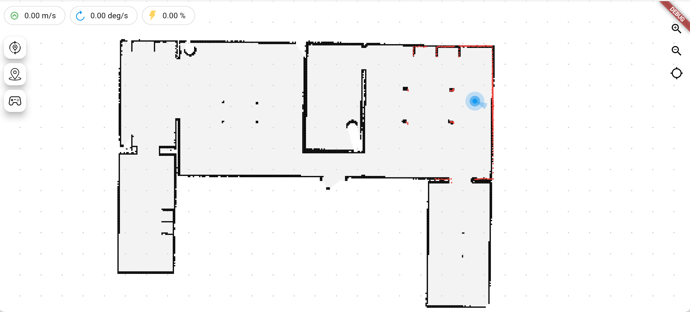
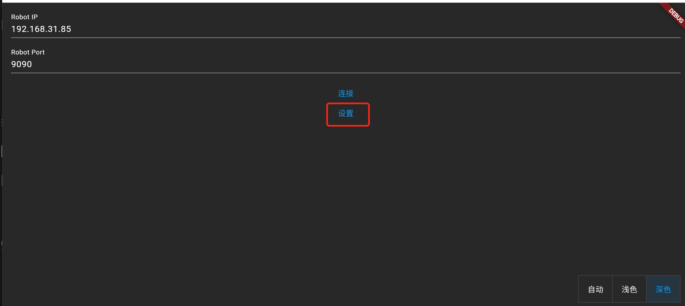

<a href="http://qm.qq.com/cgi-bin/qm/qr?_wv=1027&k=mvzoO6tJQtu0ZQYa_itHW7JrT0i4OCdK&authKey=exOT53pUpRG85mwuSMstWKbLlnrme%2FEuJE0Rt%2Fw6ONNvfHqftoWMay03mk1Qi7yv&noverify=0&group_code=797497206">

</a>


借助ros bridge websocket实现的跨平台flutter gui 人机交互软件
本项目已接入CI,保证多环境可用,并自动打包多平台二进制Release版本

*目录* 
<!-- TOC -->

- [一，使用教程](#一使用教程)
    - [1.1 下载项目 Release 包](#11-下载项目-release-包)
    - [1.2 运行项目](#12-运行项目)
        - [1.2.1 web端运行指南](#121-web端运行指南)
    - [1.3 机器人端环境配置](#13-机器人端环境配置)
        - [ROS 1](#ros-1)
            - [安装 rosbridgesuite](#安装-rosbridgesuite)
            - [运行 rosbridgewebsocket](#运行-rosbridgewebsocket)
        - [ROS 2](#ros-2)
            - [安装 rosbridgesuite](#安装-rosbridgesuite)
            - [运行 rosbridgewebsocket](#运行-rosbridgewebsocket)
    - [1.4 软件运行](#14-软件运行)
    - [1.5 引用](#15-引用)
- [引用说明](#引用说明)

<!-- /TOC -->


*项目截图*




功能/TODO:
  
| 功能                        | 状态 | 备注                 |
| --------------------------- | ---- | -------------------- |
| ROS1/ROS2通信               | ✅    |                      |
| 地图显示           | ✅    |                      |
| 机器人实时位置显示          | ✅    |                      |
| 机器人速度仪表盘            | ✅     |                      |
| 机器人手动控制              | ✅    |                      |
| 机器人重定位                | ✅    |                      |
| 机器人单点/多点导航         |  ✅    |                      |
| 机器人全局/局部规划轨迹显示 | ✅    |                      |
| 机器人拓扑地图功能          | ❌    |                      |
| 电池电量显示                | ✅     |                      |
| 地图编辑功能                | ❌    |                      |
| 机器人导航任务链            |❌    |               |
| 地图加载                    | ❌    |                      |
| 地图保存                    | ❌    |                      |
| 相机图像显示                | ❌    |  |
| 机器人车身轮廓显示          | ❌    | 支持配置异形车身     |
| 图层相机视角调整          | ✅     |      |

  <picture>
    <source media="(prefers-color-scheme: dark)" srcset="https://api.star-history.com/svg?repos=chengyangkj/Ros_Flutter_Gui_App&type=Timeline&theme=dark" />
    <source media="(prefers-color-scheme: light)" srcset="https://api.star-history.com/svg?repos=chengyangkj/Ros_Flutter_Gui_App&type=Timeline" />
    
  </picture>

# 一，使用教程
## 1.1 下载项目 Release 包

从[Release界面](https://github.com/chengyangkj/ROS_Flutter_Gui_App/releases) 下载所需要的对应环境的版本（windows，linux，web，android）

## 1.2 运行项目

解压下载的压缩包，APP端下载后即可运行，web端运行时需要借助网站服务器这里介绍下web端使用：

### 1.2.1 web端运行指南

从[Release界面](https://github.com/chengyangkj/ROS_Flutter_Gui_App/releases)下载最新的web端版本(ros_flutter_gui_app_web.tar.gz)  
解压到本地，借助Apache等网站服务器部署即可  

进入压缩包目录：
```shell
cd ros_flutter_gui_app_web
```
我这里采用python的来搭建一个简单的网站服务器：

```shell
python -m http.server 8000
```
由于这里指定的端口为8000，在google浏览器(其他浏览器未测试，可能出现空白界面问题)输入`本机ip:8000`即可访问站点

## 1.3 机器人端环境配置

软件借助ros bridge websocket实现与ros之间的通信，因此需要先在自己的机器人系统上安装ros bridget websocket并运行，由于ROS Bridge websocket的实现兼容ros1与ros2，因此这里区分ros1 与 ros2分别介绍安装教程
 
### ROS 1

#### 安装 rosbridge_suite

1. **确保已安装 ROS 1**（例如：ROS Melodic 或 ROS Noetic）。如果没有，请参考 [ROS 安装指南](http://wiki.ros.org/ROS/Installation) 进行安装。

2. **安装 `rosbridge_suite` 包**：

   ```bash
   sudo apt-get install ros-<your-ros-distro>-rosbridge-suite
   ```

   将 `<your-ros-distro>` 替换为你的 ROS 版本，例如 `melodic` 或 `noetic`。

#### 运行 rosbridge_websocket

1. **启动 ROS 核心**：

   ```bash
   roscore
   ```

2. **在新的终端中，启动 rosbridge_websocket 节点**：

   ```bash
   roslaunch rosbridge_server rosbridge_websocket.launch
   ```

3. **验证 rosbridge_websocket 是否正在运行**：

   打开浏览器，导航到 `http://localhost:9090`，如果连接成功，说明 WebSocket 服务器已启动并运行。

### ROS 2

#### 安装 rosbridge_suite

1. **确保已安装 ROS 2**（例如：ROS Foxy、Galactic 或 Humble）。如果没有，请参考 [ROS 2 安装指南](https://docs.ros.org/en/foxy/Installation.html) 进行安装。

2. **安装 `rosbridge_suite` 包**：

   ```bash
   sudo apt-get install ros-<your-ros2-distro>-rosbridge-suite
   ```

   将 `<your-ros2-distro>` 替换为你的 ROS 2 版本，例如 `foxy`、`galactic` 或 `humble`。

3. **在每个新的终端会话中，source 你的 ROS 2 环境**：

   ```bash
   source /opt/ros/<your-ros2-distro>/setup.bash
   ```

#### 运行 rosbridge_websocket

1. **在新的终端中，启动 rosbridge_websocket 节点**：

   ```bash
   ros2 launch rosbridge_server rosbridge_websocket_launch.xml
   ```

2. **验证 rosbridge_websocket 是否正在运行**：

   打开浏览器，导航到 `http://localhost:9090`，如果连接成功，说明 WebSocket 服务器已启动并运行。

## 1.4 软件运行

打开软件，进行topic设置：



设置界面：


配置说明
|配置名|消息类型|说明|
|---|---|---|
|battery_topic|sensor_msgs/BatteryState|机器人电池电量的topic，软件订阅 |
|mapTopic|nav_msgs/OccupancyGrid|机器人地图话题名，软件订阅 |
|laserTopic|sensor_msgs/LaserScan| 激光话题名，软件订阅|
|localPathTopic|nav_msgs/Path|机器人局部路径话题名，软件订阅 |
|globalPathTopic|nav_msgs/Path|机器人全局路径话题名，软件订阅 |
|odomTopic|nav_msgs/Odometry|机器人里程计话题名，软件订阅 |
|relocTopic|geometry_msgs/PoseWithCovarianceStamped|机器人重定位topic名，软件发布 |
|navGoalTopic|geometry_msgs/PoseStamped|机器人导航目标点话题名，软件发布 |
|SpeedCtrlTopic|geometry_msgs/Twist|机器人速度控制话题名，软件发布|
|maxVx|double|软件手动控制时最大vx速度 |
|maxVydouble|软件手动控制时最大vy速度 |
|maxVw|double|软件手动控制时最大vw速度 |
|mapFrameName|string|地图坐标系tf fram名|
|baseLinkFrameName|string|机器人底盘坐标系tf fram名|

设置完成后，点击connect按钮，连接到rosbridge_websocket，连接成功后，软件会自动订阅设置的topic，并显示topic的数据：

# 引用说明

- 部分UI界面效果参考自[ros_navigation_command_app](https://github.com/Rongix/ros_navigation_command_app)，仅参考UI显示效果，本仓库的代码的实现均为原创
- [roslibdart](https://pub.dev/packages/roslibdart)，实现flutter 中的ros bridge websocket的通信，借助此库可以直接与ros进行端对端通信
- [matrix_gesture_detector](https://pub.dev/packages/matrix_gesture_detector) 软件的手势识别在此pub包的基础上做更改
